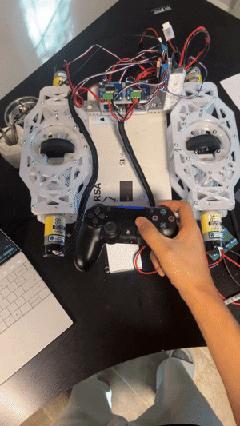

# epic-diffy-swerve

# OVERVIEW:

This repo contains all the files for an epic differential swerve. 

It's a fully 3D printed two-wheel differential swerve bot. All the parts can be sourced from Gobilda.com and Amazon, and it was made as a mini side project using spare parts from my FTC team, #23928 The Double Quarter Pounders. The current design runs off of 1150rpm motors for optimal acceleration/torque, but the geartrain can be edited to slot in any 4 spare motors you may have. 

Onshape link: https://cad.onshape.com/documents/e89bd9e2708e9aa3231597a3/w/33a491f01641b866d8c23332/e/f96b385fd39f2c792421a8a4?renderMode=0&uiState=6aa0b582fead6f9ffc14cb51

The current code is configured to teleoperate the bot with a PS4 controller. 

# Parts:

Full BOM can be found as a PDF file in the repo files. Full cost is $540. Building it with spare motors is recommended, which brings it down to $320.

Most of the parts found in this assembly are fairly common FTC parts, so consider checking your stock before ordering.

# Extra:
Swerve pods can also play music (Aria Math by C418) by pressing left on the DPad. Works by modulating the PWM frequency. 
